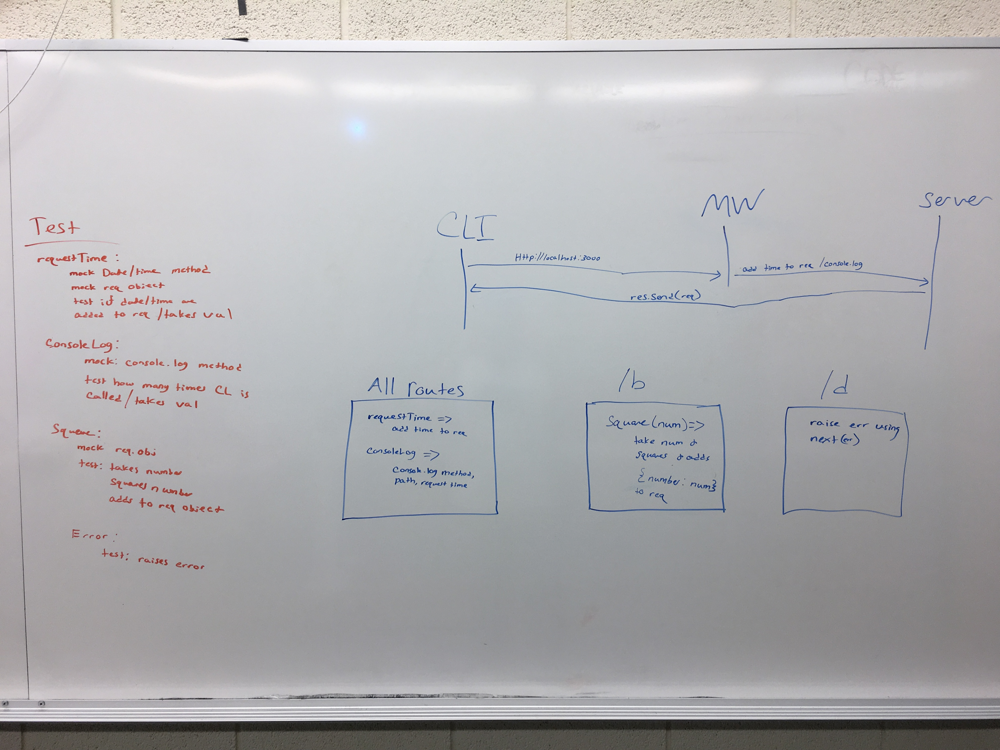

# LAB - Lab-07-middleware

## Middleware

### Author: Michael Chapman, Jeff Lawrence, Chloie

### Links and Resources
* [submission PR](https://github.com/michaelchapman-401-advanced-javascript/lab-07-middleware/pull/1)
* [travis](https://travis-ci.org/michaelchapman-401-advanced-javascript/lab-07-middleware)

### Modules
CRUD functions

#### Running the app
* `nodemon server.js`
  
#### Tests
* NPM test

